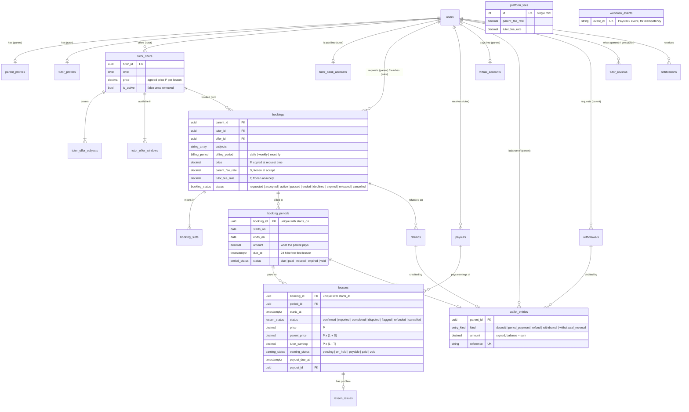

# TutorLink

Home tutoring platform for Nigerian parents: find vetted tutors, book recurring weekly lessons,
and pay ahead by bank transfer. TutorLink pays tutors after the lessons. What the product does is
specified in [`specs/`](specs/).

| Folder | What | Stack |
|---|---|---|
| [`backend/`](backend/) | REST API at `http://localhost:8000/v1` | FastAPI, SQLModel, PostgreSQL 16, Alembic, Paystack, Resend |
| [`frontend/`](frontend/) | Web app at `http://localhost:3000` | Next.js 14, TypeScript, Tailwind, shadcn/ui |

Each app has its own `README.md` (how to run it) and `CLAUDE.md` (how to work on it).

## Data model (ERD)

PostgreSQL schema, from the SQLModel tables in `backend/app/domains/*/models.py` (key columns only).
Money is `NUMERIC` naira; times are `timestamptz`, and lesson dates and times are Nigerian local time (WAT).



Key rules the schema enforces:
- One profile, bank account and dedicated account number per user (`user_id` / `tutor_id` / `parent_id` unique).
- A booking copies its price, subjects and slots when requested and freezes both fee rates when accepted,
  so later offer or fee changes never touch it.
- One period per booking start date, one lesson per booking start time; a lesson exists only for a paid period.
- A parent's balance is the sum of their `wallet_entries`; each entry's `reference` is unique, so a deposit
  or payment is never applied twice. `webhook_events` does the same for Paystack events.
- A lesson's earning is paid at most once (`lessons.payout_id`).
- One review per parent per tutor (`tutor_id, parent_id`), rating 1-5.

## Run everything locally

```bash
# Backend: API, Postgres and Adminer in Docker
cd backend
cp .env.example .env              # set SECRET_KEY; add Paystack/Resend keys when you have them
docker compose up -d --build
docker compose exec app uv run alembic upgrade head
docker compose exec app uv run python -m app.scripts.create_admin --email admin@tutorlink.ng

# Frontend
cd ../frontend
cp .env.local.example .env.local
npm install
npm run dev
```

Then open http://localhost:3000.

## Tests

```bash
cd backend  && uv run pytest     # needs the db container running
cd frontend && npm run build     # type-check + lint + production build
```
