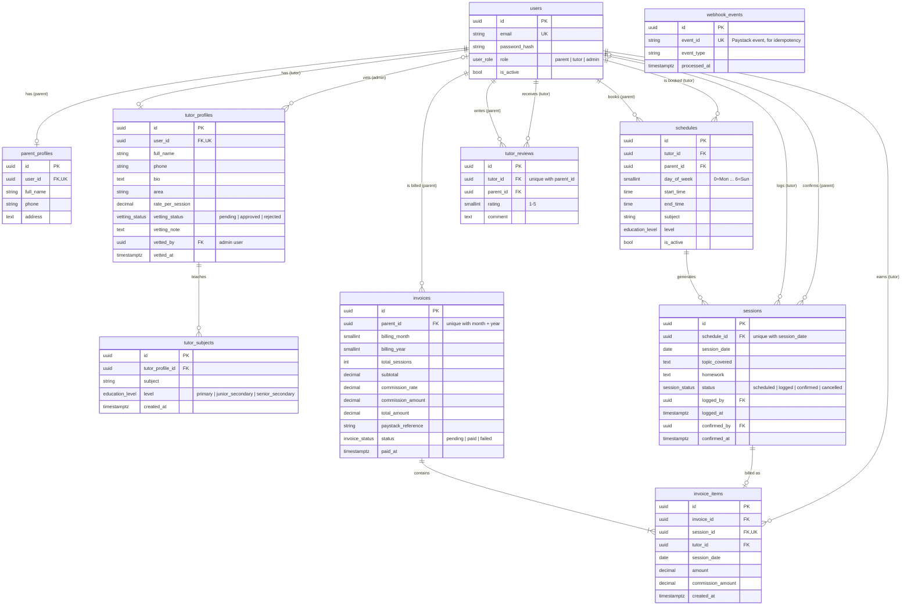

# TutorLink

Home tutoring platform for Nigerian parents: find vetted tutors, book recurring weekly lessons,
and pay monthly, only for lessons the parent confirmed.

| Folder | What | Stack |
|---|---|---|
| [`backend/`](backend/) | REST API at `http://localhost:8000/v1` | FastAPI, SQLModel, PostgreSQL 16, Alembic, Paystack, Resend |
| [`frontend/`](frontend/) | Web app at `http://localhost:3000` | Next.js 14, TypeScript, Tailwind, shadcn/ui |

Each app has its own `README.md` (how to run it) and `CLAUDE.md` (its spec).

## Data model (ERD)

PostgreSQL schema, from the SQLModel tables in `backend/app/domains/*/models.py`.
Every table except `tutor_subjects`, `invoice_items` and `webhook_events` also has `created_at` and `updated_at`.



Key rules the schema enforces:
- One profile per user: `parent_profiles.user_id` and `tutor_profiles.user_id` are unique.
- A schedule is a recurring weekly slot; each lesson is one `sessions` row, unique per `(schedule_id, session_date)`.
- A session is billed at most once (`invoice_items.session_id` is unique), and a parent gets one invoice per month (`parent_id, billing_month, billing_year`).
- One review per parent per tutor (`tutor_id, parent_id`), rating 1-5.
- `webhook_events` is standalone: it records processed Paystack events so a webhook is never applied twice.

## Run everything locally

```bash
# Backend: API, Postgres and Adminer in Docker
cd backend
cp .env.example .env              # set SECRET_KEY; add Paystack/Resend keys when you have them
docker compose up -d --build
docker compose exec app uv run alembic upgrade head
docker compose exec app uv run python -m app.scripts.create_admin --email admin@tutorlink.ng

# Frontend
cd ../frontend
cp .env.local.example .env.local
npm install
npm run dev
```

Then open http://localhost:3000.

## Tests

```bash
cd backend  && uv run pytest     # needs the db container running
cd frontend && npm run build     # type-check + lint + production build
```
